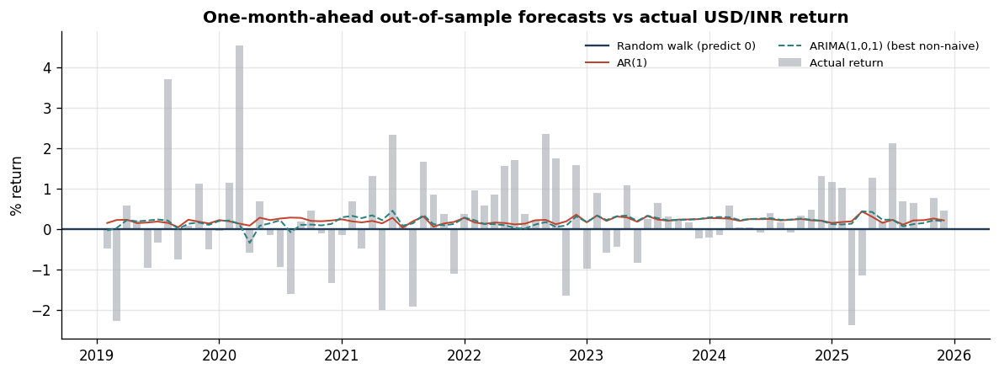
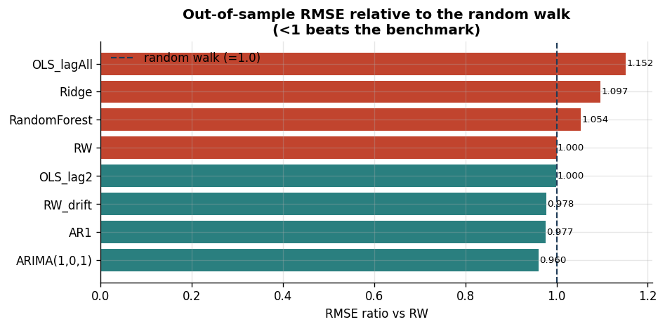
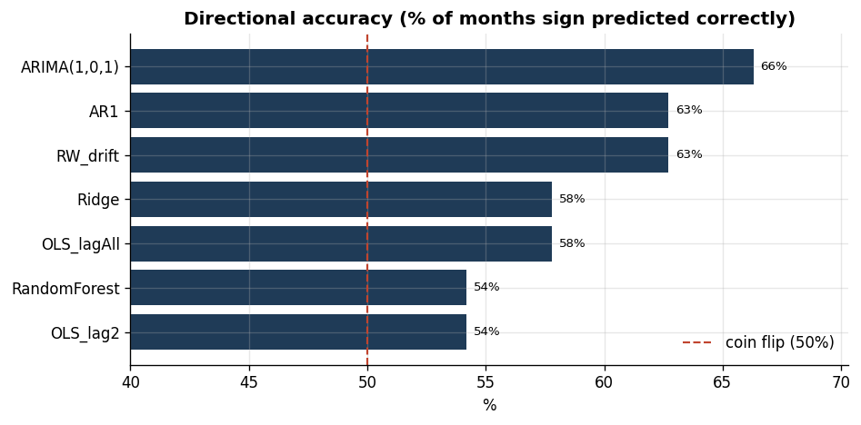
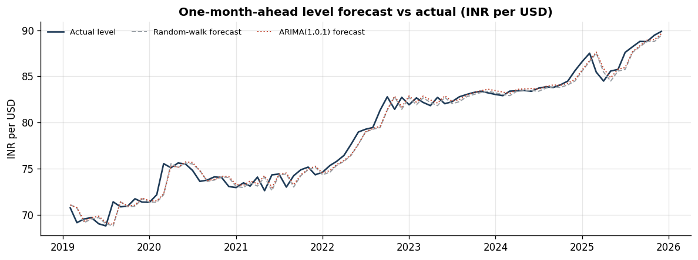

# Can We Forecast USD/INR? An Honest Out-of-Sample Study

*Companion to the contemporaneous regression in [`README.md`](README.md). Code: [`src/forecasting.py`](src/forecasting.py).*

## 1. Why this is a separate, harder question

The main study is **contemporaneous**: it regresses this month's USD/INR return on *this month's* dollar index, FPI flows, etc. That explains ≈ 28% of variation, but it **cannot forecast** — predicting next month's rupee would require knowing next month's dollar move, which is not available at decision time.

A genuine forecast may use **only information available before the month being predicted**. So here every predictor is **lagged one month**, and every model is judged **out-of-sample** against the benchmark that has humbled exchange-rate forecasters since Meese & Rogoff (1983):

> **Random walk (RW):** the best forecast of next month's level is *this* month's level — i.e. predict a return of **zero**.

The question is simply: *can anything reliably beat "no change"?*

## 2. Design

- **Target:** one-month-ahead USD/INR log return (and the implied level).
- **Predictors (all lagged one month):** the nine regressors from the main study — `Oil_Return`, `Gold_Return`, `Inflation_Differential`, `Interest_Rate_Differential`, `FPI_Flow`, `Trade_Balance`, `FX_Reserves_Change`, `VIX`, `Broad_USD_Return` — plus an autoregressive term (last month's return).
- **Evaluation:** **expanding-window walk-forward**. Train on the first 60 months, forecast month 61, add it, refit, repeat. This yields **83 true out-of-sample months (Feb 2019 – Dec 2025)**, including COVID and the 2022 tightening cycle. No future information ever enters a forecast.
- **Metrics:** RMSE, MAE, **directional accuracy**, **RMSE ratio vs RW** (Theil-style; < 1 beats the benchmark), and the **Diebold–Mariano (DM)** test of equal predictive accuracy vs RW.

**Models:** `RW` (predict 0) · `RW_drift` (historical mean) · `AR1` · `ARIMA(1,0,1)` · `OLS_lag2` (lagged broad-USD + FPI + AR) · `OLS_lagAll` (all nine lagged + AR) · `Ridge` · `RandomForest`.

## 3. Results

| Model | RMSE (%) | MAE (%) | Dir. acc. | RMSE ÷ RW | DM vs RW | DM p |
|---|---:|---:|---:|---:|---:|---:|
| **RW (benchmark)** | **1.193** | 0.872 | – | **1.000** | – | – |
| RW_drift | 1.167 | 0.838 | 62.7% | 0.978 | −1.17 | 0.241 |
| AR(1) | 1.165 | 0.838 | 62.7% | 0.977 | −1.25 | 0.210 |
| **ARIMA(1,0,1)** | **1.146** | 0.822 | 66.3% | **0.960** | −2.16 | **0.031** |
| OLS_lag2 (lagged macro) | 1.193 | 0.870 | 54.2% | 1.000 | −0.01 | 0.994 |
| OLS_lagAll | 1.375 | 1.003 | 57.8% | 1.152 | +2.23 | 0.026 |
| Ridge | 1.309 | 0.946 | 57.8% | 1.097 | +1.71 | 0.087 |
| RandomForest | 1.257 | 0.948 | 54.2% | 1.054 | +1.09 | 0.274 |

*(A **negative** DM statistic means lower squared error than the random walk, i.e. better.)*

**Level-forecast accuracy (RMSE in ₹ per US$):** RW 0.917 · RW_drift 0.895 · AR(1) 0.894 · **ARIMA(1,0,1) 0.880** · OLS_lag2 0.915 · OLS_lagAll 1.044 · Ridge 0.995 · RandomForest 0.962.



*Actual monthly returns swing ±2–4%; every forecast hugs a thin band near +0.2%. The models barely move off the random-walk line — a direct picture of how little is predictable.*



## 4. What the numbers say

1. **The lagged macro/flow signal is essentially zero.** `OLS_lag2` lands at an RMSE ratio of **1.000** (DM p = 0.99): last month's dollar move and FPI flows carry **no** usable information about next month's rupee. The strong *contemporaneous* relationship does **not** translate into predictability — the textbook signature of an efficient market.

2. **Flexible models overfit and lose.** `OLS_lagAll`, `Ridge`, and `RandomForest` are all **worse** than the random walk (ratios 1.05–1.15; `OLS_lagAll` significantly worse, DM p = 0.03). With ~10 weak predictors and a 1-month horizon, added flexibility buys variance, not signal.

3. **The only edge is the depreciation drift.** `RW_drift`, `AR(1)`, and `ARIMA(1,0,1)` beat the zero-RW slightly because the rupee has drifted weaker (~0.25%/month). `ARIMA(1,0,1)` is the best and is **marginally significant** (ratio 0.96, DM p = 0.031) — but the gain is economically tiny (RMSE 1.146% vs 1.193%, ≈ 0.04 ₹ on the level), and **most of it is just the drift**: against `RW_drift` (a fairer benchmark) ARIMA's advantage nearly vanishes (1.146 vs 1.167).

4. **The 63–66% "directional accuracy" is a base-rate illusion, not skill.** The rupee depreciated in **62.7%** of OOS months, so a rule that *always predicts depreciation* scores ~63% automatically. The drift-based models essentially do that. It is not evidence of forecasting the *fluctuations*.



**Bottom line:** consistent with Meese–Rogoff and market efficiency, **one-month USD/INR returns are close to unpredictable.** Nothing reliably beats the random walk except a small, drift-driven edge; richer macro and machine-learning models do worse, not better.

## 5. Next-month point forecast

From the last in-sample month (**Dec 2025 = 89.88 ₹/US$**), the one-month-ahead forecasts for **Jan 2026** are:

| Model | Predicted return | Implied level | ~68% band (±1.19%) |
|---|---:|---:|---|
| RW | +0.00% | **89.88** | 88.81 – 90.96 |
| RW_drift | +0.25% | 90.10 | 89.03 – 91.19 |
| AR(1) | +0.24% | 90.09 | 89.02 – 91.17 |
| OLS_lag2 | +0.10% | 89.97 | 88.90 – 91.05 |



**Reality check (out-of-time).** The price series actually extends past the model sample: realized **Jan 2026 = 91.99**, a **+2.32%** depreciation. Every model — including the best — badly underpredicted it; the move sat near the **2σ edge** of the forecast distribution (±1.19% is 1σ; ±2.38% is ≈ 2σ). This is exactly the fat-tailed behaviour the residual diagnostics flagged: monthly FX is dominated by occasional large, unforecastable jumps. It is a vivid reminder that a tight point forecast is far less honest than a wide interval.

## 6. Limitations & extensions

- **Publication lags.** Inflation, trade, and reserves are released with a delay, so even "month *t*" values may not be known when forecasting *t+1*; a stricter setup would use only fully-published vintages. (This only *weakens* the lagged-macro case further.)
- **Single horizon.** Only *h* = 1 month is tested; multi-horizon and daily-frequency forecasts are natural follow-ups.
- **No economic value test.** RMSE ≠ profit; a proper trading evaluation would net out the bid-ask spread and the interest-rate carry.
- **Regimes.** Explicit crisis/intervention dummies or a regime-switching/GARCH volatility model would better capture the tails than the point models here.

## 7. Reproduce

**No setup (Colab/Jupyter):** paste **`forecasting_colab.py`** into one cell and run — the dataset is embedded, so there are no files to upload; the metrics print and the four charts render inline.

**From the repo:**
```bash
pip install -r requirements.txt          # adds scikit-learn for Ridge/RandomForest
python src/forecasting.py                # walk-forward eval -> results/ + charts/fcst1-4
```

Outputs: `results/forecast_metrics.csv`, `results/forecast_oos_predictions.csv`, `results/forecast_level_rmse.csv`, `results/forecast_summary.json`, and `charts/fcst1–fcst4`.
