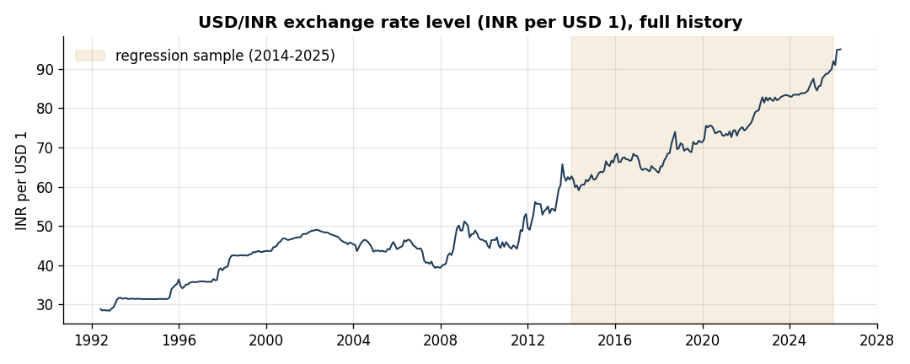
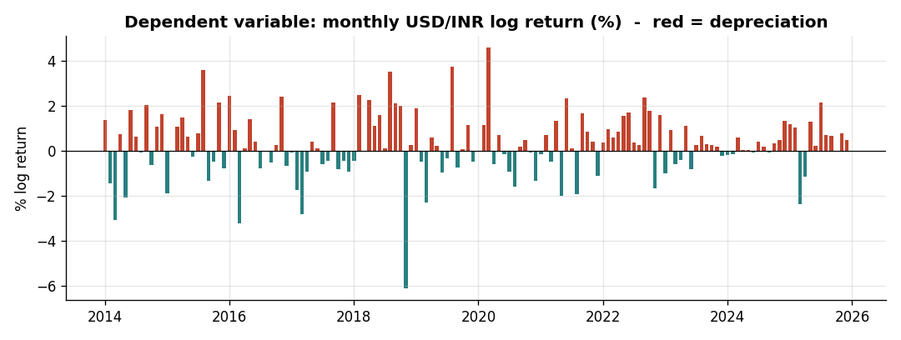
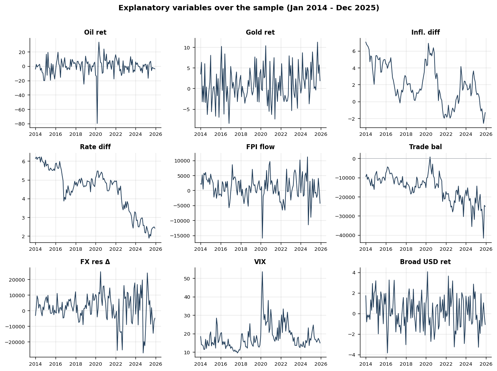
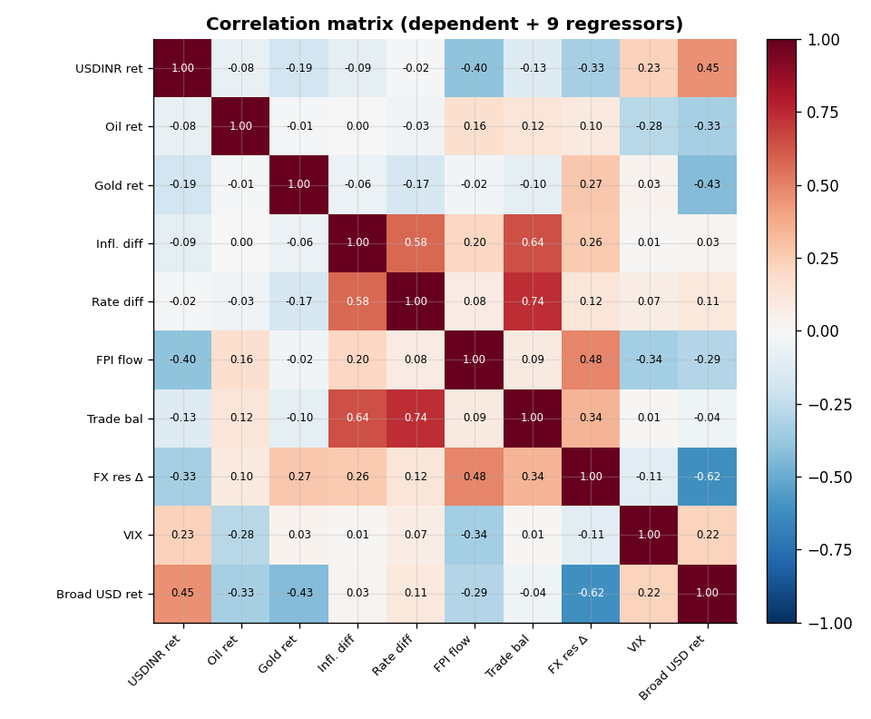
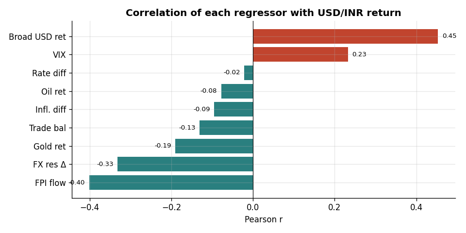
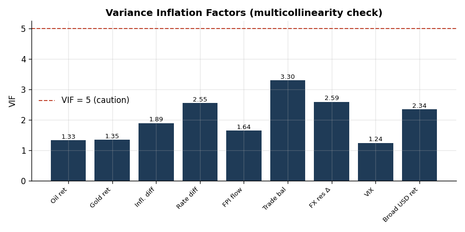
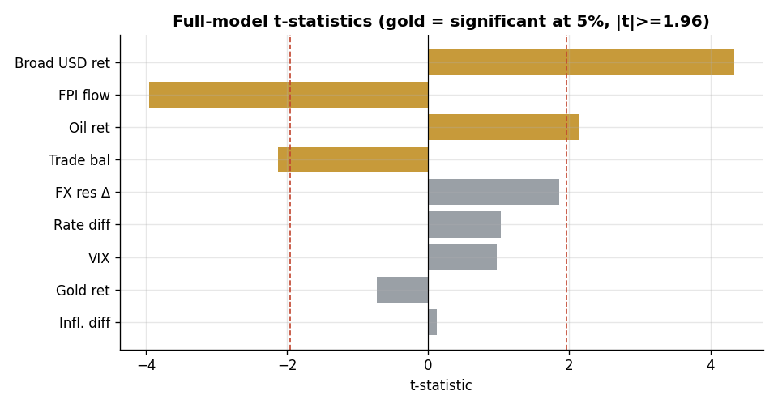
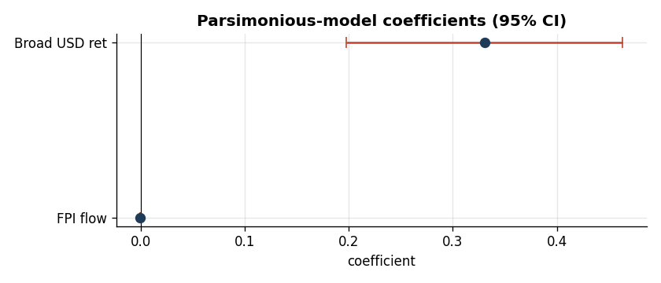
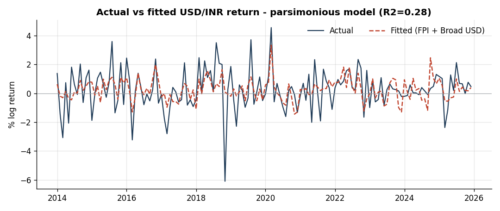
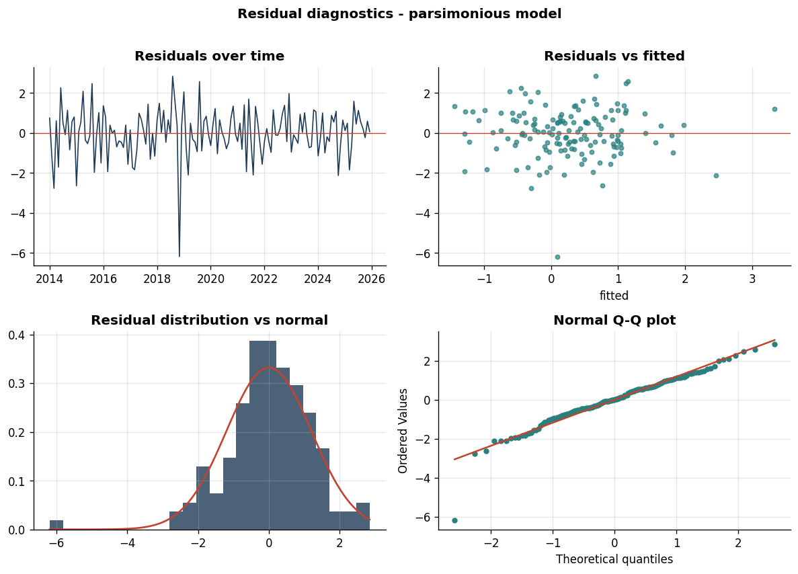

# Drivers of Monthly USD/INR Movements: A Contemporaneous Regression Study (2014–2025)

A linear-regression study of what drives **monthly movements in the Indian rupee against the US dollar (USD/INR, ₹ per US 1)**. The dependent variable is the **monthly log return** of USD/INR, regressed on macroeconomic, commodity, trade, capital-flow and market-sentiment factors.

> **Headline result.** In a contemporaneous monthly regression from January 2014 to December 2025, **broad US-dollar strength** and **net foreign-portfolio-investment (FPI) flows** are the most robust **same-month correlates** of USD/INR returns. The preferred two-factor model explains ≈ 28% of monthly variation. Slow-moving macro fundamentals (inflation and interest-rate differentials, the trade balance) are statistically insignificant *and* non-stationary at the monthly horizon, and are excluded. **Results should be read as same-month associations, not causal or out-of-sample forecasting evidence.**

> **Forecasting companion.** A separate out-of-sample study ([`FORECASTING.md`](FORECASTING.md)) asks whether *next-month* USD/INR can be predicted from lagged information. The honest answer: **no model reliably beats a random walk** — lagged macro signals add nothing and machine-learning models overfit; only a small depreciation-drift edge survives (ARIMA RMSE ratio 0.96, DM p = 0.03). This is consistent with market efficiency and Meese–Rogoff.

---

## 1. Research question

> *How do inflation, interest-rate differentials, capital flows, the trade balance, commodity prices, central-bank reserves, and global risk sentiment affect the monthly return of the USD/INR exchange rate?*

A rise in USD/INR means the **rupee depreciates** (more rupees per dollar). The study uses returns rather than levels because exchange rates, commodity prices and reserves are trending, non-stationary series; regressing one trending level on another can produce a **spurious regression**. Returns and first-differences remove the trends so the regression tests genuine co-movement.

---

## 2. Data

**Frequency:** monthly. **Sample for estimation:** **January 2014 – December 2025 (N = 144 months)**. The start is bound by India's CPI (base 2012) inflation series, which yields year-on-year inflation only from Jan 2014; the end is bound by the latest available India CPI print.

| Variable (model term) | Source | Native form → transform | Units |
|---|---|---|---|
| USD/INR (dependent) | Bloomberg `INR REGN` | month-end level → **log return** | % |
| Brent crude `Oil_Return` | Bloomberg `CO1` | month-end → **log return** | % |
| Gold `Gold_Return` | Bloomberg `XAU` | month-end → **log return** | % |
| India CPI / US CPI → `Inflation_Differential` | MOSPI (General, All-Groups) / FRED `CPIAUCSL` | index → **YoY %**, then India − US | pp |
| India 10Y / US 10Y → `Interest_Rate_Differential` | Bloomberg `GIND10YR` / `USGG10YR` | month-end yields → India − US | pp |
| FPI net flows `FPI_Flow` | NSDL | monthly net (equity+debt+hybrid+MF+AIF) | USD mn |
| Trade balance `Trade_Balance` | Bloomberg `INMTBAL$` | monthly net merchandise balance | USD mn |
| FX reserves → `FX_Reserves_Change` | Bloomberg (India reserves) | month-end level → **monthly change** | USD mn |
| VIX `VIX` | Bloomberg `VIX` | month-end level | index |
| Broad USD index `Broad_USD_Return` | FRED `DTWEXBGS` | daily → month-end → **log return** | % |
| Geopolitical Risk `GPR` *(robustness)* | Caldara–Iacoviello | daily → monthly mean | index |

**Two gaps were patched** before transforming, both flagged during data validation: Brent May-2024 (geometric interpolation of Apr/Jun) and US CPI Oct-2025 (cancelled in the government shutdown; geometric interpolation of Sep/Nov). `DTWEXBGS` is the **broad trade-weighted dollar index — a public-domain proxy for the proprietary DXY**, not the ICE DXY itself.

USD/INR has trended from ≈ ₹28 (1992) to ≈ ₹95 (2026); the shaded band is the estimation sample.



---

## 3. Methodology

1. Convert price series (USD/INR, Brent, gold, dollar index) to **monthly log returns**, `100 · ln(Pₜ / Pₜ₋₁)`.
2. Convert both CPI indices to **year-on-year inflation**, then form `Inflation_Differential = India − US`.
3. Form `Interest_Rate_Differential = India 10Y − US 10Y` and `FX_Reserves_Change = ΔReserves`.
4. Align all series on the calendar month and trim to 2014-01…2025-12.
5. **Descriptive statistics → ADF stationarity tests → correlation & covariance → VIF → full OLS → backward elimination → residual diagnostics → robustness.**

The dependent variable is

```
USDINR_Return = β0 + β1·Oil_Return + β2·Gold_Return + β3·Inflation_Differential
              + β4·Interest_Rate_Differential + β5·FPI_Flow + β6·Trade_Balance
              + β7·FX_Reserves_Change + β8·VIX + β9·Broad_USD_Return + ε
```



---

## 4. Descriptive statistics

| Variable | mean | std | min | max | skew | kurt |
|---|---:|---:|---:|---:|---:|---:|
| USDINR_Return (%) | 0.26 | 1.42 | −6.09 | 4.56 | −0.44 | 2.73 |
| Oil_Return (%) | −0.42 | 11.28 | −79.82 | 33.51 | −2.31 | 16.61 |
| Gold_Return (%) | 0.89 | 4.05 | −8.49 | 11.26 | 0.24 | −0.28 |
| Inflation_Differential (pp) | 2.15 | 2.38 | −2.61 | 7.05 | 0.12 | −0.84 |
| Interest_Rate_Differential (pp) | 4.46 | 1.17 | 1.89 | 6.22 | −0.57 | −0.70 |
| FPI_Flow (USD mn) | 895 | 3 911 | −15 924 | 11 162 | −0.57 | 2.35 |
| Trade_Balance (USD mn) | −15 438 | 6 883 | −41 686 | 793 | −0.78 | 1.06 |
| FX_Reserves_Change (USD mn) | 1 981 | 8 916 | −27 226 | 24 996 | −0.58 | 1.46 |
| VIX | 18.09 | 6.62 | 9.51 | 53.54 | 1.96 | 5.90 |
| Broad_USD_Return (%) | 0.17 | 1.58 | −3.86 | 4.06 | 0.00 | −0.37 |

The rupee depreciated on average **0.26%/month (~3.1%/yr)**. Oil is by far the most volatile input (the −80% log move is the Feb→Mar 2020 collapse). The trade balance is persistently negative (a structural deficit averaging ≈ USD 15 bn/month). Full per-variable time series:



---

## 5. Stationarity — guarding against spurious regression

Augmented Dickey–Fuller tests on every regression variable:

| Variable | ADF stat | p-value | Stationary (5%)? |
|---|---:|---:|:--:|
| USDINR_Return | −9.79 | 0.000 | ✅ |
| Oil_Return | −7.84 | 0.000 | ✅ |
| Gold_Return | −11.73 | 0.000 | ✅ |
| **Inflation_Differential** | −2.58 | 0.097 | ❌ |
| **Interest_Rate_Differential** | −0.77 | 0.828 | ❌ |
| FPI_Flow | −5.11 | 0.000 | ✅ |
| **Trade_Balance** | −0.52 | 0.888 | ❌ |
| FX_Reserves_Change | −7.84 | 0.000 | ✅ |
| VIX | −5.27 | 0.000 | ✅ |
| Broad_USD_Return | −7.56 | 0.000 | ✅ |

**Three regressors are non-stationary**: the inflation differential, the interest-rate differential, and the trade balance. **Including non-stationary regressors in levels can make inference unreliable**, so these variables are either excluded or tested in first differences (§13). As shown in §8 and §11, all three are *also* statistically insignificant, so the preferred model contains only stationary I(0) variables.

---

## 6. Correlation and covariance



Pairwise correlations among regressors are low to moderate (no |r| above ≈ 0.5 between distinct predictors), so the design is not plagued by collinearity. Correlation of each regressor with the dependent variable:



| Regressor | r with USDINR_Return |
|---|---:|
| Broad_USD_Return | **+0.45** |
| FPI_Flow | **−0.40** |
| FX_Reserves_Change | −0.33 |
| VIX | +0.23 |
| Gold_Return | −0.19 |
| Trade_Balance | −0.13 |
| Inflation_Differential | −0.10 |
| Oil_Return | −0.08 |
| Interest_Rate_Differential | −0.02 |

The dollar index and FPI flows have the strongest bivariate links with the rupee, in the directions theory predicts (stronger dollar → depreciation; inflows → appreciation). The full correlation and covariance matrices are in [`results/correlation_matrix.csv`](results/correlation_matrix.csv) and [`results/covariance_matrix.csv`](results/covariance_matrix.csv).

---

## 7. Multicollinearity (VIF)



| Regressor | VIF |
|---|---:|
| Trade_Balance | 3.30 |
| FX_Reserves_Change | 2.59 |
| Interest_Rate_Differential | 2.55 |
| Broad_USD_Return | 2.34 |
| Inflation_Differential | 1.89 |
| FPI_Flow | 1.64 |
| Gold_Return | 1.35 |
| Oil_Return | 1.33 |
| VIX | 1.24 |

**All VIFs are well below 5**, so there is no harmful multicollinearity. (The large "condition number" warning in the raw output reflects the very different *scales* of the variables — returns in % vs flows in USD millions — not genuine collinearity, which the VIFs rule out.)

---

## 8. Full OLS model (all nine regressors)

R² = **0.333**, Adjusted R² = **0.289**, F-test p = 9.0 × 10⁻⁹ (jointly significant), N = 144.

| Variable | Coef | Std err | t | p-value | Sig. |
|---|---:|---:|---:|---:|:--:|
| const | −1.5442 | 0.972 | −1.59 | 0.115 | |
| Oil_Return | 0.0218 | 0.010 | 2.13 | 0.035 | * |
| Gold_Return | −0.0208 | 0.029 | −0.72 | 0.471 | |
| Inflation_Differential | 0.0074 | 0.058 | 0.13 | 0.899 | |
| Interest_Rate_Differential | 0.1416 | 0.137 | 1.03 | 0.304 | |
| FPI_Flow | −0.0001 | 3.3e-05 | −3.96 | 0.000 | *** |
| Trade_Balance | −5.6e-05 | 2.6e-05 | −2.12 | 0.036 | * |
| FX_Reserves_Change | 3.4e-05 | 1.8e-05 | 1.86 | 0.065 | . |
| VIX | 0.0164 | 0.017 | 0.97 | 0.334 | |
| Broad_USD_Return | 0.4218 | 0.097 | 4.34 | 0.000 | *** |

`*** p<0.01, * p<0.05, . p<0.10`. Significance visualised as t-statistics (gold = significant):



**Standardised (beta) coefficients** rank economic importance independent of units: Broad_USD_Return **0.47**, FPI_Flow **−0.36**, Trade_Balance −0.27, FX_Reserves_Change 0.21, Oil_Return 0.17, Interest_Rate_Differential 0.12, VIX 0.08, Gold_Return −0.06, Inflation_Differential 0.01. The dollar factor and FPI dominate.

Full statsmodels output (classical and HAC): [`results/ols_full_summary.txt`](results/ols_full_summary.txt).

---

## 9. Variable selection

The preferred model is chosen by combining **stationarity checks, economic interpretation, p-values, and AIC/BIC** — not by any single rule. Backward elimination (drop the least-significant regressor while p > 0.05, refit, repeat) is used here as an **exploratory** screen; because p-value-based selection alone can overfit, it is corroborated by the other criteria. Elimination path:

| Step | Dropped | p at removal |
|---|---|---:|
| 1 | Inflation_Differential | 0.899 |
| 2 | Gold_Return | 0.474 |
| 3 | VIX | 0.353 |
| 4 | Interest_Rate_Differential | 0.234 |
| 5 | FX_Reserves_Change | 0.077 |
| 6 | Trade_Balance | 0.157 |
| 7 | Oil_Return | 0.172 |

Notably, **the two screens agree**: all three non-stationary variables (inflation differential, rate differential, trade balance) are eliminated on significance grounds too. Oil and the trade balance, significant in the full model, lose significance once correlated regressors are removed (their explanatory content overlapped with FX-reserve changes and the dollar factor) — i.e. their full-model significance was not robust.

---

## 10. Parsimonious model (preferred specification)

```
USDINR_Return = 0.299  −  0.000106 · FPI_Flow  +  0.3305 · Broad_USD_Return
                (0.005)     (<0.001)               (<0.001)        ← p-values
```

| Variable | Coef | Std err | t | p (classical) | p (HAC) | 95% CI |
|---|---:|---:|---:|---:|---:|---|
| const | 0.2988 | 0.105 | 2.84 | 0.005 | 0.000 | [0.09, 0.51] |
| FPI_Flow | −0.000106 | 2.7e-05 | −3.93 | 0.000 | 0.0001 | [−0.00016, −0.00005] |
| Broad_USD_Return | 0.3305 | 0.067 | 4.92 | 0.000 | 0.000 | [0.20, 0.46] |

R² = **0.284**, Adjusted R² = **0.274**, F p = 5.9 × 10⁻¹¹, **AIC 466.5, BIC 475.4**, N = 144. VIF = 1.09 for both regressors. Significance is **robust to HAC (Newey–West) standard errors**, so it does not rely on the textbook error assumptions.



**The reduced model is statistically preferred to the full model:** lower AIC (466.5 vs 470.2) and much lower BIC (475.4 vs 499.9), with essentially the same explanatory power (adj-R² 0.274 vs 0.289) using two regressors instead of nine.



---

## 11. Residual diagnostics

| Test | Statistic / p | Verdict |
|---|---|---|
| Durbin–Watson | 2.30 | No positive autocorrelation ✅ |
| Breusch–Godfrey (12 lags) | p = 0.342 | No serial correlation ✅ |
| Breusch–Pagan | p = 0.850 | Homoskedastic ✅ |
| White | p = 0.994 | Homoskedastic ✅ |
| Ramsey RESET | p = 0.424 | Linear functional form OK ✅ |
| Jarque–Bera | p ≈ 0.000 | Residuals **non-normal** ❌ |



The model **passes the serial-correlation (Breusch–Godfrey), heteroskedasticity (Breusch–Pagan / White) and functional-form (RESET) checks, but the residuals are non-normal** (Jarque–Bera) — driven by one extreme outlier month (visible bottom-left in the Q–Q plot) and the fat tails typical of monthly FX returns. With N = 144 the central limit theorem keeps OLS inference asymptotically valid, and the HAC-robust p-values (§10) reinforce the conclusions.

---

## 12. Economic interpretation

**The two robust drivers (parsimonious model):**

- **Broad_USD_Return (+0.33, p < 0.001).** A 1-percentage-point rise in the broad dollar index's monthly return is associated with a **+0.33 pp USD/INR return, i.e. the rupee depreciates**. This is the strongest predictor (β = 0.47) and matches theory directly: a globally stronger dollar mechanically weakens the rupee. It captures the "speculation / dollar-strength" channel (factor 8).
- **FPI_Flow (−0.000106, p < 0.001).** Each **+USD 1 billion** of net foreign portfolio inflow is associated with a **≈ 0.11% rupee appreciation** (negative USD/INR return); a large +USD 5 bn month implies ≈ 0.5% appreciation. Inflows raise demand for rupees and strengthen the currency, exactly as the capital-flows channel (factor 3) predicts. The March-2020 outflow of −USD 15.9 bn coincides with sharp depreciation.
- **Constant (+0.30, p < 0.01).** A baseline ≈ 0.30%/month (~3.6%/yr) depreciation drift not explained by flows or the dollar — consistent with the long-run rupee downtrend in §2 (the inflation/risk-premium gap that PPP predicts over long horizons).

**Do the signs match theory?** In the full model, most signs are theory-consistent: Oil_Return **+** (India is an oil importer → higher oil weakens the rupee ✅), Inflation_Differential **+** (higher relative Indian inflation → depreciation ✅, but insignificant), FPI_Flow **−** ✅, Trade_Balance **−** (a wider deficit, i.e. a more negative balance, raises USD/INR ✅), VIX **+** (risk-off → depreciation ✅, insignificant), Broad_USD_Return **+** ✅. Two are counter-intuitive: the **interest-rate differential is positive** (carry theory predicts higher Indian yields should *attract* flows and strengthen the rupee) — but it is insignificant and non-stationary, and the positive sign likely reflects that wide rate gaps coincide with EM risk premia; and **FX_Reserves_Change flips sign** between the bivariate correlation (−0.33) and the multiple regression (+), a classic partial-vs-marginal effect; its classical p-value is borderline (0.065) though it is significant under HAC (0.033), and given this instability it is not retained in the preferred specification.

**Why are the macro fundamentals insignificant at the monthly horizon?** Inflation and interest-rate differentials move slowly and operate on the exchange rate over *years* (PPP, uncovered interest parity hold weakly month-to-month). Monthly FX returns are dominated by high-frequency forces — capital flows and the global dollar cycle — which is exactly what the surviving variables capture. This echoes the long-standing Meese–Rogoff finding that macro fundamentals poorly explain short-horizon exchange-rate movements.

---

## 13. Robustness checks

- **HAC (Newey–West) standard errors.** In the *preferred* model, FPI and the broad-USD return remain significant at p ≤ 0.0001. In the *full* model significance is more fragile: `Oil_Return` is significant under classical SE but **not** under HAC (p = 0.19), `FX_Reserves_Change` becomes significant **only** under HAC (p = 0.03), and `Trade_Balance` is significant but non-stationary. This sensitivity is exactly why the two-factor model — selected on stationarity, robustness, parsimony and AIC/BIC — is preferred, and why we avoid claiming these are the *only* variables that matter.
- **Differencing the non-stationary variables.** Re-introducing the three eliminated regressors *as first-differences* (so they are stationary) into the parsimonious model leaves all three insignificant — `Δinflation-diff` p = 0.12, `Δrate-diff` p = 0.49, `Δtrade-balance` p = 0.54 — while FPI and the broad-USD return are unchanged and R² barely moves (0.298). Their exclusion is therefore not an artefact of the levels/stationarity choice; **they show no reliable monthly association with USD/INR returns in this sample**.
- **Suggested further checks** (not yet run): lag the flow and sentiment variables one month to test predictive (vs contemporaneous) effects; add **crisis dummies** (COVID 2020-03/04, Russia–Ukraine 2022, the 2025–26 Middle-East/gold-shock episode); add the **GPR geopolitical-risk index** (supplied, daily→monthly) as an alternative to VIX; estimate over **sub-samples** (pre/post-2020) for parameter stability; and try **USD/INR futures volume / NDF premium** for the speculation channel once collected.

---

## 14. Limitations

1. **Contemporaneous, not causal.** Coefficients are same-month associations; FPI flows and the rupee are jointly determined (a depreciating rupee can itself trigger outflows), so endogeneity/reverse causality cannot be excluded without instruments or a VAR.
2. **Non-normal residuals** from crisis-month outliers; quantile or robust regression could complement OLS.
3. **DTWEXBGS is a DXY proxy** (broad TWI, includes more currencies), not the ICE DXY.
4. **One interpolated month each** for Brent and US CPI; the FX-reserves series appears to be foreign-currency assets (peak ≈ USD 617 bn) rather than headline total reserves — confirm the exact Bloomberg definition.
5. **Linear, single-equation** specification; regime-switching or GARCH effects (volatility clustering) are not modelled.
6. **Modest R² (≈ 0.28)** — most monthly FX variation is unforecastable noise, as the literature expects.

---

## 15. Repository structure & reproduction

```
usd-inr-regression/
├── README.md                          ← this report (contemporaneous study)
├── FORECASTING.md                     ← companion: honest out-of-sample forecasting study
├── requirements.txt
├── .gitignore
├── USDINR_regression.ipynb            ← self-contained notebook (Run all)
├── USDINR_regression_executed.ipynb   ← same, outputs pre-rendered (view on GitHub)
├── usdinr_regression_colab.py         ← self-contained regression script (data embedded, Colab one-cell)
├── forecasting_colab.py               ← self-contained forecasting script (data embedded, Colab one-cell)
├── data/
│   ├── usdinr_master_dataset.csv      ← all variables + levels, 2014–2025
│   ├── regression_data.csv            ← dependent + 9 regressors (model input)
│   ├── usdinr_full.csv                ← full-history USD/INR level (context chart)
│   └── raw/                           ← NOT committed (gitignored); put the 14 source files here to rebuild
├── src/
│   ├── regression_analysis.py         ← build, descriptives, ADF, corr/cov, VIF, OLS, selection, diagnostics
│   ├── charts_and_robustness.py       ← all figures, HAC, standardised betas, robustness
│   └── forecasting.py                 ← 1-month-ahead walk-forward forecasts vs random walk
├── results/                           ← CSV/TXT/JSON of every table (incl. forecast_*)
└── charts/                            ← fig1–fig10 + fcst1–fcst4 (PNG)
```

**Reproduce — no setup (recommended):** open `USDINR_regression.ipynb` in Colab or Jupyter and *Run all*. The 144-month dataset is embedded, so nothing needs to be downloaded.

**Reproduce from raw source files:**
```bash
pip install -r requirements.txt
# place the 14 source files in data/raw/  (see "Data availability" below)
python src/regression_analysis.py      # builds data/ + results/
python src/charts_and_robustness.py    # builds charts/
```

**Data availability.** The raw source files are **not redistributed** here because some carry vendor licences (notably the Bloomberg exports), so they are excluded via `.gitignore`. To rebuild from scratch, obtain them from the sources in §2 / the acknowledgements and place the 14 files in `data/raw/` (filenames are listed in `data/raw/README.md`). The derived **monthly series are embedded in the notebook and `usdinr_regression_colab.py`**, so the full analysis reproduces without the raw files.

**Core regression code:**
```python
import statsmodels.api as sm
from statsmodels.stats.outliers_influence import variance_inflation_factor

y = data["USDINR_Return"]
X = sm.add_constant(data[REGRESSORS])

full = sm.OLS(y, X).fit()                                   # full model
full_hac = sm.OLS(y, X).fit(cov_type="HAC",                 # robust SE
                            cov_kwds={"maxlags": 6})
print(full.summary())

# VIF
vif = [variance_inflation_factor(X.values, i) for i in range(X.shape[1])]

# parsimonious model after backward elimination
red = sm.OLS(y, sm.add_constant(data[["FPI_Flow", "Broad_USD_Return"]])).fit()
print(red.summary())
```

---

### Data-source acknowledgements
Bloomberg (USD/INR, Brent, gold, VIX, India & US 10Y yields, India trade balance & reserves); MOSPI (India CPI); FRED / U.S. BLS (`CPIAUCSL`, `DTWEXBGS`); NSDL (FPI flows); Caldara & Iacoviello (Geopolitical Risk Index). *This study is for research/educational purposes and is not investment advice.*
